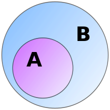
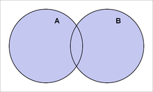
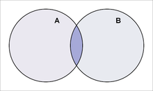
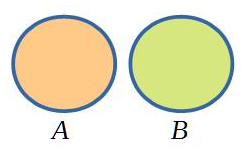
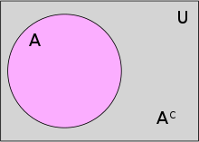

# 集合及其运算

## 集合的概念
> 一些可区分的互不相同的**东西**构成的**整体**称为集合

|       |   元素    |     集合     |
| :---: | :-------: | :----------: |
| 表示  |  $x,y,z$  |   $X,Y,Z$    |
| 关系  | $x \in y$ | $x \notin y$ |
  

## 集合的表示方法
1. 枚举法(列举法)  
$A = \{马云,...,马化腾\}$  
$N = \{1,2,\ldots,n\}$  
2. 描述法(概括集合中元素的性质)  
$B = \{x|P(x)\}$&ensp;&ensp;&ensp;&ensp;$P(x)$：命题
  

## 集合的分类
* 无穷集合
* 有穷集合
* 空集 $\emptyset$  
  

## 子集、集合的相等
> 定义1：设$A，B$为集合，如果$A$中每个元素都属于$B$，则称$A$为$B$的子集，记作$A \subseteq B$  
> $A \subseteq B \Longleftrightarrow \forall x \in A, x \in B$  
> $if x \notin B,则x \notin A$

真子集：$A \subset B \Longleftrightarrow A \subseteq B$ $\exists x \in B 使得 x \notin A$
&ensp;&ensp;&ensp;&ensp;$A \subsetneq B \Longleftrightarrow \exists x \in A, x \in B$  

显然：
> 1. $A \subseteq A$
> 2. $if\ A \subseteq B, B \subseteq C,then\ A \subseteq C$
> 3. $\emptyset \subseteq A$

例:证明 $\emptyset \subseteq A$  
Ans1:  
证不属于$A$的元素一定不属于$\emptyset$ (定义一的逆否命题)  
  
Ans2:  
假设$p,q$是命题，$p \rightarrow q$&ensp;&ensp;&ensp;&ensp;''$if\ p\ than\ q$''$--$复合命题(当且仅当条件为真，结论为假，复合命题为假)  
证''$if x \in \emptyset\ than\ x \in A$''  
  
> 定义2: $设A，B为集合，if\ A \subseteq B\ 且\ B \subseteq A,则A与B相等，记作A=B$  
  
显然：  
> 4. $A=A$
> 5. $if\ A=B,then\ B=A$
> 6. $if\ A=B,B=C,then\ A=C$

集族：集合的集合  
幂集：$设A为集合， P(A) = \{B|B \subseteq A\}$（$A所有子集的集合,也记作2^A$）  
  
康托悖论:$设M为所有集合的集合，2^M \subseteq M，则|2^M| \leq |M|与|M| < |2^M|同时成立$  
  
$2^\emptyset=\{\emptyset\},则\emptyset \subseteq 2^\emptyset,\emptyset \subseteq 2^\emptyset$  
  

## 集合的运算
**并运算**  
> 定义：$设A，B为集合，由属于A或属于B的所有元素组成的集合称为A与B的并，记作A \cup B，A \cup B=\{x|x \in A或x \in B\}$  
  

  
$x \in A \cup B \Longleftrightarrow x \in A或x \in B$  
$x \notin A \cup B \Longleftrightarrow x \notin A且x \notin B$  
> 定理一 $设A，B，C为集合\ then$  
> 1) $A \cup A = A$ (幂等律)
> 2) $A \cup B = B \cup A$  
> 3) $(A \cup B) \cup C = A \cup (B \cup C)$  
> 4) $\emptyset \cup A = A$  
> 5) $A \cup B = B \Longleftrightarrow A \subseteq B$(吸收律)
  
$\because (A \cup B) \cup C = A \cup (B \cup C)， \therefore A \cup B \cup C有意义$  
$\therefore可设A_1,A_2,\ldots A_n为集合，使他们的并记作\cup^n_{i=1}A_i = A_1 \cup A_2 \cup \ldots \cup A_n$  
即  
$x \in \cup^n_{i=1}A_i \Longleftrightarrow \exists\ i，1 \leq i \leq n，x \in A_i$  
$\cup^\infin_{i=1}A_i=A_1 \cup A_2 \cup \ldots \cup A_\infin$  
$I \in N，x \in \cup_{\xi \in I}A_\xi \Longleftrightarrow \exists\ \xi \in I，x \in A_\xi$

**交运算**  
> 定义：$设A，B为集合，由属于A并且属于B的所有元素组成的集合称为A与B的交，记作A \cap B，A \cap B=\{x|x \in A且x \in B\}$   

 
  
$x \in A \cap B \Longleftrightarrow x \in A且x \in B$  
$x \notin A \cap B \Longleftrightarrow x \notin A或x \notin B$  
> 定理二 $设A，B，C为集合\ then$  
> 1) $A \cap A = A$ (幂等律)
> 2) $A \cap B = B \cap A$  
> 3) $(A \cap B) \cap C = A \cap (B \cap C)$  
> 4) $\emptyset \cap A = \emptyset$  
> 5) $A \cap B = A \Longleftrightarrow A \subseteq B$(吸收律)  
  
$\because \emptyset \cap A = \emptyset，\therefore A \cap B \cap C有意义$  
$\therefore可设A_1,A_2,\ldots A_n为集合，使他们的交记作\cap^n_{i=1}A_i = A_1 \cap A_2 \cap \ldots \cap A_n$  
即  
$x \in \cap^n_{i=1}A_i \Longleftrightarrow \forall\ i，1 \leq i \leq n，x \in A_i$  
$\cap^\infin_{i=1}A_i=A_1 \cap A_2 \cap \ldots \cap A_\infin$  
$I \in N，x \in \cap_{\xi \in I}A_\xi \Longleftrightarrow \forall\ \xi \in I，x \in A_\xi$  
$x \in \cap^\infty_{i=1}A_i \Longleftrightarrow \forall\ i \in N，x \in A_i$  
$if A_i \cap A_j = \emptyset\ then\ A_i与A_j不相交$  

两两不相交：$\cap^n_{i=1}A_i=A_1 \cap A_2 \cap \ldots \cap A_n， \forall\ i，j且1\leq i，j \leq n，if A_i \cap A_j = \emptyset，than两两不相交$  
  

[不交集](https://zh.wikipedia.org/wiki/%E4%B8%8D%E4%BA%A4%E9%9B%86)
> 定理三 $设A，B，C为集合\ then$  
> 1) $A \cap(\cup_{\xi \in I}A_\xi) = \cup_{\xi \in I}(A \cap A_\xi)$  
> 2) $A \cup(\cap_{\xi \in I}A_\xi) = \cap_{\xi \in I}(A \cup A_\xi)$  
  
> 定理四 $设A，B，C为集合\ then$  
> 1) $A \cap (B \cup C) = (A \cap B) \cup (A \cap C)$
> 2) $A \cup (B \cap C) = (A \cup B) \cap (A \cup C)$  
> 3) $A \cap (A \cup B) = A$
> 4) $A \cup (A \cap B) = A$  
  
**差运算**  
> 定义：$设A，B为集合，由属于A但不属于B的所有元素组成的集合称为A与B的差，记作A \backslash B，x \in A \backslash B \Longleftrightarrow x \in A，x \notin B$  
  
> 定理五 $设A，B，C为集合\ then$  
> 1) $A \cap (B \backslash C)=(A \cap B) \backslash (A \cap C)$  
  
**对称差**  
> 定义：$设A，B为集合，则集合(A \backslash B) \cup (B \backslash A)称为A与B的对称差，记作A \triangle B$  
  

  
> 定理四 $设A，B，C为集合\ then$  
> 1) $A \triangle B = B \triangle A$
> 2) $A \triangle (B \triangle C) = (A \triangle B) \triangle C$
> 3) $A \triangle A = \emptyset$
> 4) $A \triangle \emptyset = A$
> 5) $A \cap (B \triangle C) = (A \cap B) \triangle (A \cap C)$  
  
例:$A \triangle X = B, 求 X?$  
$A \triangle (A \triangle X) = X = A \triangle B$  

**求补(绝对补集) & De Morgan公式**  
> 定义：$若给定全集U，则 A在U中的相对补集称为A的绝对补集（简称补集），记为 A^C$  
> $即A^C = U \backslash A$&ensp;&ensp;&ensp;&ensp;$x \in A^C \Longleftrightarrow x \in U，x \notin A$  
  
  
> 定理五 $设S为集合，A \subseteq S\ then$  
> 1) $S^C = \emptyset$  
> 2) $\emptyset = S$  
> 3) $A \cup A^C = S$(特征性质)  
> 4) $A \cap A^C = \emptyset$(特征性质)  
  
> 定理六 $设\{A_\xi\}_{\xi \in I}为集族$  
> 1) $(\cup_{\xi \in I}A_\xi)^C = \cap_{\xi \in I}A^C_\xi$
> 2) $(\cap_{\xi \in I}A_\xi)^C = \cup_{\xi \in I}A^C_\xi$  
> 1、2合成德摩根定律  
> $(A \cup B)^C = A^C \cap B^C$  
> $(A \cap B)^C = A^C \cup B^C$  
  
**对偶原理**  
|    $\cup$    |    $\cap$    |     $=$      | $\subseteq$  | $\supseteq$  |    $A^C$     |     $^C$     |
| :----------: | :----------: | :----------: | :----------: | :----------: | :----------: | :----------: |
| $\downarrow$ | $\downarrow$ | $\downarrow$ | $\downarrow$ | $\downarrow$ | $\downarrow$ | $\downarrow$ |
|    $\cap$    |    $\cup$    |      =       | $\supseteq$  | $\subseteq$  |     $A$      |     $^C$     |  

**笛卡尔积**  

